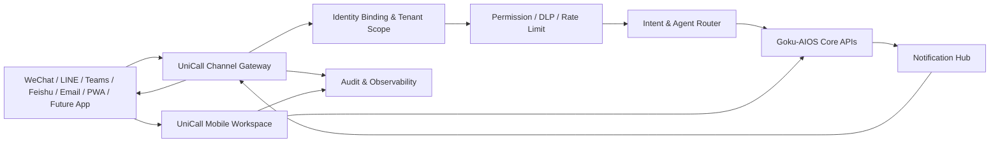

# UniCall — 统一移动工作台与渠道网关 Roadmap

> **状态核对 · 2026-05-31：** 初版 Gateway 已合入 `main`（migration 0070，
> `unicall` router，Feishu / Email / PWA adapters，identity binding，
> notification service，mobile API）。下方清单仍是完整 MVP 验收表；
> 未勾选项表示尚未逐项完成验收，不等同于完全未实现。

**项目代号**：UniCall
**定位**：Goku-AIOS 的统一移动入口层与多渠道交互网关
**规划日期**：2026-05-29
**建议周期**：8 周完成 MVP，12 周达到生产可推广
**目标用户**：企业内部员工、外部客户、审批人、移动场景一线人员

---

## 1. 项目判断

Goku-AIOS 已经具备飞书、邮件、Teams、WeChat、LINE 等渠道能力，也已有开放 API、SDK、PWA、Web Push、审批、任务、通知等基础模块。下一阶段的重点不应继续堆叠单点渠道，而是把这些入口收敛成一个统一的移动交互体系。

UniCall 的核心不是“再做一个聊天 App”，而是让用户可以通过任意移动入口与 Goku-AIOS 稳定、安全、可审计地互动，并在复杂场景中切换到统一移动工作台完成任务。

---

## 2. 产品目标

### 2.1 一句话目标

让用户在 WeChat、LINE、Teams、飞书、邮件、PWA 或未来独立 App 中，以一致的身份、权限、消息体验和审计链路调用 Goku-AIOS。

### 2.2 第一阶段不做什么

- 不重写现有飞书、Teams、WeChat、LINE、邮件能力
- 不立即开发完整原生 App
- 不把渠道逻辑散落到各 Agent 或业务工具中
- 不让每个渠道维护一套独立审批、任务、通知、用户绑定逻辑

### 2.3 核心交付

| 模块 | 目标 |
|------|------|
| Channel Gateway | 统一接收、解析、路由、回调、审计所有渠道消息 |
| Mobile Workspace | 移动端任务、审批、通知、Agent 对话工作台 |
| Identity Binding | 统一绑定外部身份与 AIOS 用户、租户、部门、角色 |
| Interaction Model | 统一文本、按钮、卡片、附件、审批动作的数据结构 |
| Notification Hub | 统一通知策略、投递通道、去重、失败重试 |
| Admin Console | 渠道健康、绑定关系、消息日志、失败队列、策略配置 |

---

## 3. 目标架构



### 3.1 核心原则

| 原则 | 说明 |
|------|------|
| 渠道只做适配 | WeChat/LINE/Teams/飞书/邮件只负责协议差异，不承载业务流程 |
| 工作台承载复杂交互 | 长表单、审批详情、文件上传、历史追踪统一跳转 Mobile Workspace |
| 身份先绑定再执行 | 外部 user id 必须映射到 AIOS user_id、tenant_id 后才能调用 Agent |
| 所有动作可审计 | 消息、按钮、审批、任务创建、通知投递都写入统一日志 |
| 先 PWA 后 App | 先把移动体验沉淀为 Web/PWA，独立 App 后续只做更强移动壳 |

---

## 4. 现有基础复用

| 现有能力 | 建议复用方式 |
|----------|--------------|
| `/api/external/v1` 开放 API | 作为 UniCall 创建任务、查询任务、订阅事件的基础接口 |
| `aios-sdk` | 作为外部集成示例和 channel adapter 的 Python client 参考 |
| `approvals` API | 移动审批卡片、按钮回调、审批详情页直接复用 |
| `notifications` API | 站内通知与移动通知统一入口 |
| `push_subscriptions` / Web Push | PWA 通知能力复用 |
| `ConnectorConfig` | 扩展为 UniCall 渠道配置和健康检查页面 |
| `line_bot.py` / `teams_bot.py` / connectors | 抽象为统一 adapter 接口，避免继续复制逻辑 |
| `TaskDetail` / `ApprovalDetail` / `ChatPage` | 移动工作台复用或轻量重构 |

---

## 5. 数据模型规划

### 5.1 新增表：`channel_accounts`

保存外部渠道身份与 AIOS 用户的绑定关系。

| 字段 | 类型 | 说明 |
|------|------|------|
| id | bigint | 主键 |
| tenant_id | bigint | 租户 |
| user_id | bigint | AIOS 用户 |
| channel | varchar | `wechat` / `line` / `teams` / `feishu` / `email` / `pwa` |
| external_user_id | varchar | openId、LINE userId、Teams user id、邮箱等 |
| external_display_name | varchar | 渠道侧显示名 |
| status | varchar | `pending` / `active` / `disabled` / `revoked` |
| bound_at | datetime | 绑定时间 |
| last_seen_at | datetime | 最近互动 |
| metadata | json | 渠道扩展信息 |

唯一约束：

```sql
UNIQUE(channel, external_user_id)
UNIQUE(tenant_id, user_id, channel, external_user_id)
```

### 5.2 新增表：`channel_messages`

保存统一入站/出站消息日志。

| 字段 | 类型 | 说明 |
|------|------|------|
| id | bigint | 主键 |
| tenant_id | bigint | 租户 |
| channel | varchar | 渠道 |
| direction | varchar | `inbound` / `outbound` |
| external_message_id | varchar | 渠道消息 ID |
| user_id | bigint | 绑定后的 AIOS 用户，可为空 |
| conversation_id | bigint | AIOS 会话，可为空 |
| task_id | varchar | 关联任务，可为空 |
| message_type | varchar | `text` / `card` / `button` / `file` / `approval` / `system` |
| payload | json | 统一消息 payload |
| raw_payload | json | 原始渠道 payload |
| status | varchar | `received` / `routed` / `sent` / `failed` |
| error | text | 错误信息 |
| created_at | datetime | 创建时间 |

### 5.3 新增表：`channel_actions`

保存按钮、审批、深链回调等用户动作。

| 字段 | 类型 | 说明 |
|------|------|------|
| id | bigint | 主键 |
| tenant_id | bigint | 租户 |
| user_id | bigint | 操作人 |
| channel | varchar | 来源渠道 |
| action_type | varchar | `approve` / `reject` / `open_task` / `reply` / `run_agent` |
| target_type | varchar | `task` / `approval` / `conversation` / `notification` |
| target_id | varchar | 目标 ID |
| payload | json | 动作参数 |
| idempotency_key | varchar | 幂等键 |
| status | varchar | `pending` / `completed` / `failed` |
| created_at | datetime | 创建时间 |

### 5.4 新增表：`notification_deliveries`

统一通知投递记录。

| 字段 | 类型 | 说明 |
|------|------|------|
| id | bigint | 主键 |
| tenant_id | bigint | 租户 |
| user_id | bigint | 接收人 |
| notification_id | bigint | 站内通知 ID，可为空 |
| channel | varchar | 投递渠道 |
| priority | varchar | `low` / `normal` / `high` / `urgent` |
| title | varchar | 标题 |
| body | text | 内容 |
| payload | json | 结构化内容 |
| status | varchar | `queued` / `sent` / `failed` / `skipped` |
| retry_count | int | 重试次数 |
| provider_message_id | varchar | 渠道返回 ID |
| sent_at | datetime | 投递时间 |

---

## 6. 统一消息协议

### 6.1 入站消息

```json
{
  "channel": "line",
  "external_user_id": "Uxxxxxxxx",
  "tenant_hint": "your-tenant",
  "type": "text",
  "text": "帮我看一下今天的审批",
  "attachments": [],
  "raw": {}
}
```

### 6.2 出站卡片

```json
{
  "type": "task_result",
  "title": "任务已完成",
  "body": "Q4 营收摘要已生成。",
  "actions": [
    {"id": "open_task", "label": "查看详情", "style": "primary"},
    {"id": "share", "label": "转发", "style": "secondary"}
  ],
  "deep_link": "/mobile/tasks/task_123"
}
```

### 6.3 审批动作

```json
{
  "type": "approval_action",
  "approval_id": "appr_123",
  "action": "approve",
  "comment": "确认可以发送",
  "idempotency_key": "line:Uxxx:appr_123:approve:20260529"
}
```

---

## 7. 产品功能范围

### 7.1 Mobile Workspace MVP

| 页面 | 功能 |
|------|------|
| `/mobile` | 今日任务、待审批、未读通知、最近 Agent |
| `/mobile/chat` | 移动端 Agent 对话，支持选择 Agent、发起任务、查看流式输出 |
| `/mobile/tasks` | 任务列表、状态筛选、搜索、任务详情 |
| `/mobile/approvals` | 待审批列表、详情、批准、驳回、补充意见 |
| `/mobile/notifications` | 通知列表、已读/未读、跳转目标 |
| `/mobile/bind` | 渠道账号绑定、解绑、绑定状态 |

### 7.2 Channel Gateway MVP

| 能力 | 说明 |
|------|------|
| Inbound Webhook | 统一接收各渠道消息 |
| Identity Resolver | 将 external_user_id 解析为 AIOS user |
| Message Normalizer | 转换为统一消息结构 |
| Intent Router | 判断是普通聊天、审批动作、任务查询还是绑定流程 |
| Agent Invocation | 创建会话或任务，调用已有 Agent runtime |
| Outbound Renderer | 将统一卡片渲染为各渠道支持格式 |
| Delivery Tracker | 记录发送状态、失败原因、重试次数 |

### 7.3 Admin Console MVP

| 页面 | 功能 |
|------|------|
| 渠道总览 | 每个渠道启用状态、健康检查、最近错误 |
| 账号绑定 | 查询用户绑定的外部账号，支持解绑和禁用 |
| 消息日志 | 按用户、渠道、任务、状态搜索 |
| 通知投递 | 查看投递历史、失败重试、跳过原因 |
| 策略配置 | 默认通知渠道、优先级、静默时间、升级策略 |

---

## 8. 实施阶段

## Phase 0 — 现状盘点与接口冻结（Week 0-1）

**目标**：确认已有飞书、邮件实现边界，冻结 UniCall 第一版接口；WeChat 企业版因注册审批周期较长，进入后续渠道队列。

### TASK 0.1 渠道能力盘点

| 渠道 | 需确认项 |
|------|----------|
| 飞书 | Bot、卡片、审批回调、用户 ID 映射、消息签名、卡片按钮能力 |
| Email | 入站解析、审批回复、通知去重、邮箱到用户的自动匹配 |
| Teams | Bot / webhook / adaptive card 支持范围，作为第二个内部 IM 对照渠道 |
| WeChat | 企业微信注册审批状态、小程序/公众号形态、用户 ID 类型、模板消息限制 |
| LINE | Messaging API、LIFF、用户绑定方式、按钮/卡片能力 |
| PWA | Web Push、Service Worker、移动布局状态 |

交付物：

- [x] `unicall_channel_inventory.md`
- [x] 渠道能力矩阵
- [x] 第一版统一消息 JSON Schema
- [x] 第一版深链规范

### TASK 0.2 技术边界确认

需确认：

- 是否作为 Goku-AIOS 内置模块开发，还是独立服务
- 是否复用现有数据库，还是单独 schema
- 移动工作台是否复用现有 React 前端
- 是否需要多租户自定义域名

建议结论：

- MVP 阶段作为 Goku-AIOS 内置模块开发
- 数据表进入主库，带 tenant_id
- 前端复用现有 React/Vite 项目
- 后续再拆独立服务

---

## Phase 1 — Channel Gateway Core（Week 1-3）

**目标**：把各渠道消息统一接入、绑定、路由、审计。

### TASK 1.1 数据库迁移

新增：

- `channel_accounts`
- `channel_messages`
- `channel_actions`
- `notification_deliveries`

验收：

- [x] Alembic migration 可重复执行
- [x] 所有表具备 tenant_id 索引
- [x] `channel + external_user_id` 唯一约束生效
- [x] 消息日志按 `tenant_id, created_at` 查询 P95 < 200ms

### TASK 1.2 统一 Adapter 接口

建议接口：

```python
class ChannelAdapter:
    channel: str

    def verify_request(self, request) -> bool: ...
    def parse_inbound(self, request) -> UnifiedInboundMessage: ...
    def render_outbound(self, message: UnifiedOutboundMessage) -> dict: ...
    def send(self, account: ChannelAccount, message: UnifiedOutboundMessage) -> DeliveryResult: ...
```

MVP 首批适配：

- Feishu
- Email
- PWA/Web Push

第二批适配：

- Teams
- LINE
- WeChat / 企业微信

验收：

- [x] 现有渠道逻辑迁入 adapter 或包一层兼容 adapter
- [x] 每个 adapter 有单元测试
- [x] 不改变现有生产 webhook URL 的情况下可灰度切换

### TASK 1.3 Identity Resolver

功能：

- 外部账号绑定 AIOS 用户
- 未绑定用户进入绑定流程
- 支持绑定码、深链、管理员手动绑定
- 支持解绑、禁用、重新绑定

绑定方式：

| 方式 | 场景 |
|------|------|
| 一次性绑定码 | 用户在 AIOS Web 端生成，移动渠道输入 |
| 深链绑定 | 飞书卡片链接、PWA 链接、后续 LINE LIFF / WeChat 小程序打开 `/mobile/bind` |
| 管理员绑定 | 企业导入或后台手动绑定 |
| 邮箱匹配 | Email 渠道可按 verified email 自动绑定 |

验收：

- [x] 未绑定用户不能调用 Agent
- [x] 绑定动作写审计日志
- [x] 解绑后外部消息只返回绑定提示
- [x] 同一外部账号不能绑定多个 AIOS 用户

### TASK 1.4 Gateway Router

路由规则：

| 输入 | 处理 |
|------|------|
| 纯文本 | 进入 Agent 对话或默认 Agent |
| 按钮回调 | 进入 `channel_actions` 幂等处理 |
| 审批动作 | 调用 approvals API |
| 任务查询 | 调用 tasks API |
| 文件/图片 | 走附件上传和 Agent context |
| 未识别 | 返回帮助卡片或转人工 |

验收：

- [x] 任务创建成功后返回 task card
- [x] 审批按钮可批准/驳回并防重复提交
- [x] 失败消息写入 `channel_messages.error`
- [x] 支持 channel-level rate limit

---

## Phase 2 — Mobile Workspace MVP（Week 3-5）

**目标**：提供跨渠道统一移动操作界面，承接复杂交互。

### TASK 2.1 移动首页

内容：

- 待审批数量
- 进行中任务
- 最近完成任务
- 未读通知
- 常用 Agent

验收：

- [x] 375px 宽度无横向滚动
- [x] iOS Safari、Android Chrome 可用
- [x] PWA 安装入口可见
- [ ] 首屏加载 P95 < 2s

### TASK 2.2 移动审批中心

功能：

- 待审批列表
- 审批详情
- 批准 / 驳回 / 填写意见
- 从飞书卡片、邮件链接、后续 LINE/WeChat/Teams 卡片深链进入

验收：

- [x] 渠道卡片按钮和移动页面动作走同一 API
- [x] 重复点击不会重复审批
- [x] 审批结果回推原渠道

### TASK 2.3 移动任务中心

功能：

- 任务列表
- 状态筛选
- 任务详情
- 结果展示
- 失败原因
- 重新运行

验收：

- [x] 支持从通知卡片打开任务
- [x] 支持查看 zombie retry 标记
- [x] 支持复制任务结果

### TASK 2.4 移动 Agent 对话

功能：

- 选择 Agent
- 发送文本
- 查看流式输出
- 展示 card_push
- 支持附件上传的入口

验收：

- [x] 与 Web Chat 权限一致
- [x] Agent 不可见时不能被 mobile 调用
- [x] SSE 或 fallback 轮询可用

---

## Phase 3 — Notification Hub（Week 5-6）

**目标**：统一通知生成、投递、去重、重试和用户偏好。

### TASK 3.1 通知策略

策略维度：

| 维度 | 示例 |
|------|------|
| 事件类型 | task_completed、approval_pending、approval_overdue、agent_failed |
| 优先级 | low、normal、high、urgent |
| 用户偏好 | 默认渠道、静默时间、禁用渠道 |
| 租户策略 | 工作时间、升级规则、允许渠道 |
| 去重窗口 | 同一任务 5 分钟内只通知一次 |

验收：

- [x] 同一事件不会重复轰炸多个渠道
- [x] urgent 可绕过普通静默，但仍写审计
- [x] 用户可配置默认移动通知渠道

### TASK 3.2 投递队列

建议：

- MVP 可用 APScheduler/后台任务
- 生产增强阶段接入队列，如 Redis/RQ/Celery

验收：

- [x] 失败可重试
- [x] 永久失败进入 dead-letter 状态
- [x] Admin 可手动重发

### TASK 3.3 渠道渲染

统一内容映射：

| UniCall 类型 | LINE | WeChat | Teams | 飞书 | Email | PWA |
|--------------|------|--------|-------|------|-------|-----|
| text | text | text | text | text | plain/html | notification |
| task card | flex/message | template/card | adaptive card | card | html | web card |
| approval card | buttons | template/card | adaptive card | card | approve link | web card |
| deep link | LIFF URL | 小程序路径 | tab/web URL | web URL | web URL | PWA route |

验收：

- [x] 每个渠道至少支持 task card 和 approval card
- [x] 渠道不支持按钮时降级为链接
- [x] 所有链接带短期签名或登录态校验

---

## Phase 4 — Admin & Observability（Week 6-7）

**目标**：让运营和管理员能看见、配置和修复 UniCall。

### TASK 4.1 渠道健康面板

指标：

- 启用状态
- 最近 webhook 成功/失败
- 发送成功率
- 平均投递延迟
- 最近 20 条错误
- 配置缺失项

验收：

- [x] Admin 可一眼看到哪个渠道坏了
- [x] 支持发送测试消息
- [x] 支持查看 provider 原始错误

### TASK 4.2 消息与动作审计

查询维度：

- 用户
- 渠道
- 任务
- 审批
- 时间范围
- 状态
- 错误类型

验收：

- [x] 可追踪“某个用户点了哪个按钮，触发了哪个审批结果”
- [x] 可追踪“某条通知为什么没有发出去”
- [x] 审计导出 CSV

### TASK 4.3 绑定管理

功能：

- 查询绑定
- 禁用绑定
- 解绑
- 重新发送绑定指引
- 查看最近互动

验收：

- [x] Admin 可处理用户换手机/换账号
- [x] 禁用后立即阻止渠道调用

---

## Phase 5 — Pilot & Production Hardening（Week 7-8）

**目标**：选一个真实业务场景灰度上线。

### TASK 5.1 试点场景选择

推荐优先级：

| 场景 | 推荐理由 |
|------|----------|
| 审批待处理提醒 | 闭环短、价值清晰、按钮交互适合移动端 |
| 任务完成通知 | 风险低，能验证投递和深链 |
| 每日报告推送 | 频率稳定，适合测试去重和偏好 |
| 客服/工单升级 | 高价值，但需要更强权限和降噪 |

建议首个试点：

> 审批待处理提醒 + 任务完成通知

### TASK 5.2 安全加固

必须完成：

- webhook 签名校验
- 深链短期 token
- action idempotency
- tenant scope 校验
- Agent visibility 校验
- DLP 检查
- rate limit
- audit log

验收：

- [x] 越权用户不能打开他人任务或审批
- [x] 伪造回调被拒绝
- [x] 重放按钮回调不会重复执行
- [x] 敏感内容不会进入不允许的外部渠道

### TASK 5.3 试点验收

MVP 指标：

| 指标 | 目标 |
|------|------|
| 渠道消息入站成功率 | >= 99% |
| 通知投递成功率 | >= 95% |
| 审批按钮动作成功率 | >= 99% |
| 任务完成通知延迟 P95 | <= 30s |
| 移动首页加载 P95 | <= 2s |
| 严重安全问题 | 0 |

---

## 9. 12 周生产增强路线

| 周期 | 主题 | 交付 |
|------|------|------|
| Week 1-2 | Gateway Core | 数据模型、adapter、identity resolver、message log |
| Week 3-4 | Mobile Workspace | 首页、任务、审批、通知、绑定 |
| Week 5-6 | Notification Hub | 策略、投递、去重、重试、渠道渲染 |
| Week 7-8 | Pilot | 审批提醒、任务通知、安全加固、灰度 |
| Week 9-10 | Automation & Analytics | 渠道漏斗、用户活跃、Agent 使用分析、失败自动诊断 |
| Week 11-12 | Enterprise Ready | 多租户策略、管理员工具、SLA、备份恢复、运行手册 |

---

## 10. API 规划

### 10.1 Channel Gateway API

| Method | Path | 说明 |
|--------|------|------|
| POST | `/api/v1/unicall/webhooks/{channel}` | 接收渠道 webhook |
| POST | `/api/v1/unicall/actions` | 处理按钮/审批/深链动作 |
| GET | `/api/v1/unicall/messages` | 查询消息日志 |
| GET | `/api/v1/unicall/deliveries` | 查询通知投递 |
| POST | `/api/v1/unicall/test-send` | 发送测试消息 |

### 10.2 Binding API

| Method | Path | 说明 |
|--------|------|------|
| POST | `/api/v1/unicall/bind-codes` | 生成绑定码 |
| POST | `/api/v1/unicall/bind` | 完成绑定 |
| GET | `/api/v1/unicall/accounts` | 查询绑定账号 |
| DELETE | `/api/v1/unicall/accounts/{id}` | 解绑 |
| POST | `/api/v1/unicall/accounts/{id}/disable` | 禁用绑定 |

### 10.3 Mobile Workspace API

优先复用现有 API，仅补齐移动聚合接口：

| Method | Path | 说明 |
|--------|------|------|
| GET | `/api/v1/mobile/summary` | 移动首页聚合 |
| GET | `/api/v1/mobile/deep-link/resolve` | 解析渠道深链目标 |
| GET | `/api/v1/mobile/preferences` | 用户移动通知偏好 |
| PUT | `/api/v1/mobile/preferences` | 更新偏好 |

---

## 11. 前端规划

### 11.1 路由

```text
/mobile
/mobile/chat
/mobile/tasks
/mobile/tasks/:id
/mobile/approvals
/mobile/approvals/:id
/mobile/notifications
/mobile/bind
/admin/unicall
/admin/unicall/accounts
/admin/unicall/messages
/admin/unicall/deliveries
```

### 11.2 设计原则

- 移动端优先，不做桌面端缩小版
- 第一屏只放高频动作：审批、任务、通知、对话
- 卡片只用于任务、审批、通知等重复项目
- 长内容默认折叠，详情页承载完整信息
- 所有渠道深链最终进入同一套移动页面
- 管理页保持密集、可筛选、可导出

### 11.3 关键组件

| 组件 | 用途 |
|------|------|
| `MobileShell` | 移动端布局、顶部、底部导航 |
| `MobileSummary` | 首页聚合 |
| `MobileTaskCard` | 任务摘要 |
| `MobileApprovalCard` | 审批摘要和操作 |
| `NotificationPreferencePanel` | 用户通知偏好 |
| `ChannelBindPanel` | 绑定/解绑渠道 |
| `ChannelHealthTable` | Admin 渠道健康 |
| `MessageLogTable` | Admin 消息日志 |

---

## 12. 后端规划

### 12.1 建议模块结构

```text
backend/app/routers/unicall.py
backend/app/routers/mobile.py
backend/app/services/unicall/
  __init__.py
  adapters/
    base.py
    line.py
    wechat.py
    teams.py
    feishu.py
    email.py
    pwa.py
  gateway.py
  identity.py
  renderer.py
  notifications.py
  actions.py
  schemas.py
  audit.py
```

### 12.2 迁移策略

不建议一次性删除现有渠道代码。推荐：

1. 先新增 UniCall adapter 层
2. 现有 webhook 继续工作
3. 单渠道灰度接入 UniCall
4. 完成验证后逐步切换
5. 保留旧路由一段时间作为兼容入口

---

## 13. 测试策略

### 13.1 单元测试

| 模块 | 覆盖 |
|------|------|
| adapter parse/render | 各渠道 payload 转换 |
| identity resolver | 绑定、解绑、禁用、冲突 |
| action handler | 审批幂等、任务打开、重复回调 |
| notification policy | 静默时间、优先级、去重 |
| permission guard | tenant、role、agent visibility |

### 13.2 集成测试

| 用例 | 验收 |
|------|------|
| 飞书文本创建任务 | 返回 task card |
| 邮件审批回复 | 审批状态更新 |
| 飞书卡片深链 | 打开 mobile task detail |
| 邮件通知失败 | 写入 delivery failed |
| 未绑定用户发消息 | 返回绑定提示 |
| 解绑用户重放旧按钮 | 拒绝执行 |

### 13.3 E2E

至少覆盖：

- 移动首页
- 审批列表和审批动作
- 任务详情
- 通知偏好
- Admin 消息日志

---

## 14. 风险与对策

| 风险 | 影响 | 对策 |
|------|------|------|
| 渠道能力不一致 | 同一功能在不同渠道体验不一致 | 统一卡片协议 + 渠道降级策略 |
| 外部身份映射混乱 | 越权或通知错人 | 强制绑定表、唯一约束、审计 |
| 通知轰炸 | 用户关闭通知 | 去重、静默时间、优先级策略 |
| 深链越权 | 安全事故 | 所有页面重新校验 JWT/tenant/action target |
| 旧渠道代码重复 | 维护成本上升 | adapter 迁移计划，逐步收敛 |
| 原生 App 诱惑过早 | 分散资源 | 先 PWA 和 Channel Gateway，后评估 App |

---

## 15. 是否开发独立 App 的决策门槛

在以下条件满足前，不建议启动完整原生 App：

- 移动工作台 DAU 连续 4 周稳定增长
- 移动审批或任务通知贡献 >= 30% 的关键工作流动作
- 明确出现 PWA/消息渠道无法满足的需求
- 至少 2 个企业客户要求 MDM、离线、相机、语音或强推送能力
- Gateway、Mobile API、通知策略已经稳定

满足后再启动：

| App 能力 | 必要性 |
|----------|--------|
| 原生 Push | 高可靠移动通知 |
| 语音对话 | 移动 Agent 助手 |
| 相机/OCR | 巡检、票据、现场工作 |
| 离线草稿 | 弱网环境 |
| MDM 分发 | 企业移动设备管理 |

---

## 16. MVP 完成标准

MVP 可以定义为：

- [x] 飞书完整接入 UniCall Gateway
- [x] 邮件完整接入 UniCall Gateway
- [x] Teams、LINE、WeChat / 企业微信完成后续接入设计，不阻塞 MVP
- [x] 外部账号绑定、解绑、禁用可用
- [x] 移动端可完成任务查看、审批、通知查看
- [x] 任务完成和审批待处理可通过 Notification Hub 投递
- [x] Admin 可查看渠道健康、消息日志、投递失败
- [x] 所有操作具备 tenant scope、权限校验、审计日志
- [ ] 试点场景通过 2 周灰度运行

---

## 17. 推荐第一版实施顺序

1. 数据表和统一消息协议
2. Feishu adapter
3. Email adapter
4. Identity Binding（飞书 user id + verified email）
5. 邮件审批回复和飞书审批按钮回调
6. 任务完成通知
7. 移动审批中心
8. 移动任务详情
9. Admin 消息日志
10. Notification Hub 去重和重试
11. Teams adapter 对照迁移
12. LINE / WeChat / 企业微信后续迁移

建议第一个渠道选择：

| 场景 | 首选 |
|------|------|
| 内部试点 / 审批闭环 | 飞书 + 邮件 |
| 邮件驱动业务流程 | Email |
| 内部企业协作对照 | Teams |
| 日本客户/外部客户 | LINE |
| 中国大陆/企业微信生态 | WeChat / 企业微信 |

---

## 18. 最终形态

UniCall 成熟后应成为 Goku-AIOS 的“移动交互平面”：

- 用户可以从任意渠道唤起 Agent
- Agent 可以按策略触达用户
- 审批、任务、通知跨渠道一致
- 复杂操作统一进入 Mobile Workspace
- 管理员可以观测、审计、配置所有移动互动
- 未来独立 App 只是 UniCall 的一个高级客户端，而不是另一个孤岛
